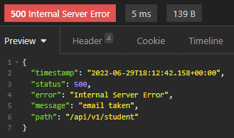
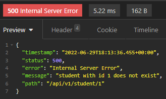
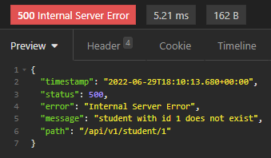

# Spring Boot basics - trainning

## About
The following repo contains a Spring Boot example that connects to an existing Database (Postgres) and uses an internal REST API that can be tested with Postman/Insomnia

## I've learned to:
* Spring Initializr at start.spring.io
* adding and changing dependencies
* connect to a database using DB Navigator plugin
* lombok annotations
* Intellij shortcuts (alt+insert) for creating/implementing methods
* JpaRepository which automatically allows main class to do a bunch of REST API methods
* the usefulness of having a Service and Repository
* common application.properties
* testing with @SpringBootTest
* routing

## Endpoints requests:

* Get - list all students:
```
http://localhost:8080/api/v1/student
```

* Post - add a student
```
{
	"name": "Ricardo",
	"email": "ricardo.parada@gmail.com",
	"dob": "2000-10-24"
}

http://localhost:8080/api/v1/student
```
#### Error message in case email is already taken:



* Put - change student data
```
http://localhost:8080/api/v1/student/1?name=DansiSeixas&email=daefp11@gmail.com
```
#### Error message in case student id doesn't exist:



* Delete - delete a student record
```
http://localhost:8080/api/v1/student/1
```
#### Error message in case student id not found:



